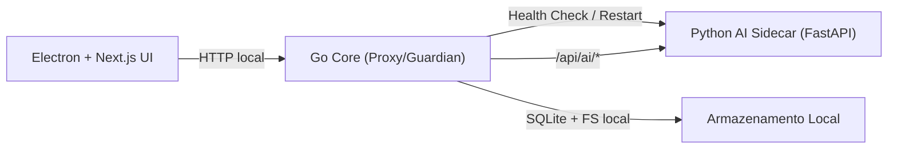

# Mamografia BI-RADS IA Desktop


Aplicacao desktop para apoio a analise de mamografias com foco em execucao local/offline, arquitetura modular e integracao de inferencia por IA.

## Sumario

- [Visao Geral](#visao-geral)
- [Objetivos do Sistema](#objetivos-do-sistema)
- [Stack Tecnologica](#stack-tecnologica)
- [Arquitetura](#arquitetura)
- [Fluxo de Inicializacao](#fluxo-de-inicializacao)
- [Estrutura do Monorepo](#estrutura-do-monorepo)
- [Politica do Modelo no GitHub](#politica-do-modelo-no-github)
- [Pre-requisitos](#pre-requisitos)
- [Quick Start (Desenvolvimento)](#quick-start-desenvolvimento)
- [Execucao em 1 Clique (macOS)](#execucao-em-1-clique-macos)
- [Endpoints Disponiveis](#endpoints-disponiveis)
- [Variaveis de Ambiente](#variaveis-de-ambiente)
- [Build de Instalador](#build-de-instalador)
- [Seguranca e Privacidade](#seguranca-e-privacidade)
- [Troubleshooting](#troubleshooting)
- [Roadmap Tecnico](#roadmap-tecnico)
- [Referencias Internas](#referencias-internas)

## Visao Geral

Este projeto implementa uma estacao de trabalho desktop para analise de mamografias BI-RADS com 3 camadas:

- UI desktop em Electron + Next.js (Nextron)
- Core orquestrador em Go (proxy principal, fila e health checks)
- Sidecar de IA em Python/FastAPI para inferencia

A interface conversa com o Go Core. O Go Core gerencia o ciclo de vida do sidecar, aplica logica de orquestracao e encaminha chamadas para inferencia.

## Objetivos do Sistema

- Operar em ambiente local/offline (sem dependencia de cloud durante uso)
- Reduzir acoplamento entre interface, orquestracao e inferencia
- Permitir distribuicao como aplicativo desktop nativo
- Preparar base para endurecimento de seguranca e requisitos LGPD

## Stack Tecnologica

| Camada | Tecnologia | Papel |
|---|---|---|
| Desktop UI | Electron + Nextron + Next.js | Interface, onboarding, splash e fluxo do usuario |
| Core | Go + Gin | API local, proxy, guardian e fila de tarefas |
| AI Engine | Python + FastAPI + TensorFlow/Keras | Carregamento do modelo e endpoint de predicao |
| Processamento de imagem | OpenCV + pipeline local | Preparacao de imagem para inferencia |
| Build/Distribuicao | electron-builder + NSIS/DEB | Gera instaladores desktop |

## Arquitetura



### Responsabilidades por camada

- UI:
  - Exibir splash durante bootstrap do core
  - Renderizar fluxo de uso
  - Consumir API local do Go Core
- Go Core:
  - Subir sidecar Python
  - Verificar health continuamente
  - Reiniciar sidecar em falhas
  - Expor endpoints locais para UI
  - Proxy para endpoints de IA
- AI Sidecar:
  - Carregar `unet_mammo_best.keras`
  - Expor `/health` e `/predict`

## Fluxo de Inicializacao

1. Electron inicia.
2. Processo principal do Electron sobe o binario Go Core.
3. Go Core inicia sidecar Python e executa health checks.
4. UI consulta `GET /startup/status` ate o sistema ficar pronto.
5. Quando o health do sidecar responde com sucesso, a UI libera a tela principal.

## Estrutura do Monorepo

```text
desktop/
  apps/
    ui/                  # Electron + Next.js
    go-core/             # Orquestrador, guardian, proxy
    ai-engine/           # FastAPI sidecar de inferencia
      models/            # Modelo final usado no app
  build/                 # Configuracao de instalador
  docker/                # Ambiente dev com CUDA
  docs/                  # Notas de arquitetura
```

## Politica do Modelo no GitHub

Este repositorio **nao** guarda pipeline de treinamento.

Regra atual:

- manter apenas artefato final de inferencia em:
  - `desktop/apps/ai-engine/models/unet_mammo_best.keras`

Arquivos de treino, datasets e jobs de cluster nao fazem parte da base versionada.

## Pre-requisitos

### Desenvolvimento local

- Node.js 20+
- npm 10+
- Go 1.22+
- Python 3.11+
- Git

### Opcional (GPU)

- Drivers NVIDIA
- CUDA compativel com TensorFlow local

## Quick Start (Desenvolvimento)

### 1) Build do Go Core

```bash
cd desktop/apps/go-core
go mod tidy
go build -o bin/go-core ./cmd/orchestrator
```

### 2) Preparar sidecar Python

```bash
cd ../ai-engine
python3 -m venv .venv
source .venv/bin/activate
pip install --upgrade pip
pip install -r requirements.txt
```

### 3) Adicionar modelo final

Coloque o modelo treinado em:

```text
desktop/apps/ai-engine/models/unet_mammo_best.keras
```

### 4) Rodar a UI desktop

```bash
cd ../ui
npm install
npm run dev
```

A UI vai iniciar o Go Core automaticamente no modo dev.

## Execucao em 1 Clique (macOS)

Voce tem duas opcoes.

### Opcao A: arquivo `.command` (duplo clique imediato)

Na raiz do projeto ja existe:

- `Mammo-Desktop-Dev.command`

No Finder:

1. abra a pasta do projeto
2. de duplo clique em `Mammo-Desktop-Dev.command`

O macOS abre um Terminal e inicia toda a stack de desenvolvimento.

### Opcao B: gerar um `.app` clicavel

Execute uma vez:

```bash
./desktop/tools/create_macos_app.sh
```

Isso gera:

- `Mammo BI-RADS Desktop Dev.app`

Depois, basta duplo clique no app para abrir o Terminal e iniciar o projeto.

### Flags uteis do launcher

Para forcar reinstalacao/rebuild quando necessario:

```bash
./desktop/tools/run_desktop_dev.sh --rebuild-go
./desktop/tools/run_desktop_dev.sh --install-ai-deps
./desktop/tools/run_desktop_dev.sh --install-ui-deps
```

## Endpoints Disponiveis

### Go Core (default `127.0.0.1:8088`)

| Endpoint | Metodo | Descricao |
|---|---|---|
| `/healthz` | GET | Health do Go Core |
| `/readyz` | GET | Prontidao geral (depende do AI sidecar) |
| `/startup/status` | GET | Estado de bootstrap para splash |
| `/api/tasks/predict` | POST | Enfileira tarefa de predicao |
| `/api/pdi/windowing` | POST | Aplica windowing local |
| `/api/ai/*` | ANY | Proxy para endpoints do AI sidecar |

### AI Sidecar (default `127.0.0.1:8090`)

| Endpoint | Metodo | Descricao |
|---|---|---|
| `/health` | GET | Health do sidecar e status de modelo carregado |
| `/predict` | POST | Predicao com upload de imagem |

### Exemplo rapido de health

```bash
curl http://127.0.0.1:8088/healthz
curl http://127.0.0.1:8088/readyz
curl http://127.0.0.1:8088/startup/status
```

## Variaveis de Ambiente

### Go Core

| Variavel | Default | Uso |
|---|---|---|
| `GO_CORE_HOST` | `127.0.0.1` | Host do core |
| `GO_CORE_PORT` | `8088` | Porta do core |
| `AI_ENGINE_URL` | `http://127.0.0.1:8090` | URL base do sidecar |
| `AI_SHARED_TOKEN` | `mammo-local-token` | Token local para proxy->sidecar |
| `AI_ENGINE_EXEC` | vazio | Binario sidecar (modo empacotado) |
| `AI_ENGINE_WORKDIR` | vazio | Diretorio de execucao do sidecar |
| `AI_ENGINE_SCRIPT` | `app/main.py` | Script Python do sidecar |
| `AI_ENGINE_PYTHON` | `python3` | Binario Python |
| `SQLITE_PATH` | `~/.mammo-desktop/mammo.db` | Banco local |
| `MAMMO_LOCAL_ROOT` | `~/.mammo-desktop` | Raiz local de dados |
| `AI_GUARDIAN_BACKOFF_MS` | `2000` | Backoff de restart |

### AI Sidecar

| Variavel | Default | Uso |
|---|---|---|
| `MODEL_PATH` | `./models/unet_mammo_best.keras` | Caminho do modelo |
| `AI_SHARED_TOKEN` | `mammo-local-token` | Token esperado no header `X-Local-Token` |

## Build de Instalador

A base de empacotamento esta em `desktop/build/electron-builder.yml`.

### Windows (NSIS)

- alvo: `.exe`
- fluxo com `electron-builder`
- suporte a tela de instalacao, pasta customizada e hooks NSIS

### Linux (DEB)

- alvo: `.deb`
- possibilidade de complementar com `fpm` para metadata/assinatura

Mais detalhes:

- `desktop/build/installer/README.md`

## Seguranca e Privacidade

Baseline atual:

- comunicacao local por `127.0.0.1`
- token compartilhado entre Go Core e sidecar (`X-Local-Token`)
- armazenamento local (SQLite + filesystem)
- orientacao offline-first para reduzir superficie de exposicao

## Troubleshooting

### 1) UI abre, mas fica presa no splash

Verifique:

```bash
curl http://127.0.0.1:8088/startup/status
```

Se nao responder, o binario Go pode nao ter sido gerado em `desktop/apps/go-core/bin/go-core`.

### 2) `model_loaded: false` no `/health`

Confirme:

- arquivo existe em `desktop/apps/ai-engine/models/unet_mammo_best.keras`
- permissao de leitura do arquivo
- versao do TensorFlow compativel com o artefato salvo

### 3) Erro de porta em uso

Ajuste `GO_CORE_PORT` e/ou `AI_ENGINE_URL` nas variaveis de ambiente.

### 4) Sidecar reinicia continuamente

Valide dependencias Python:

```bash
cd desktop/apps/ai-engine
source .venv/bin/activate
python -m pip check
```

## Roadmap Tecnico

- endurecimento de seguranca de transporte local (ex.: Unix socket)
- pipeline PDI otimizado para volumes maiores
- telemetria local e observabilidade de sessao
- empacotamento final de sidecar congelado para distribuicao
- maturacao do fluxo de instalador para operacao clinica

## Referencias Internas

- `desktop/README.md`
- `desktop/MONOREPO_STRUCTURE.md`
- `desktop/docs/ARCHITECTURE.md`
- `desktop/build/installer/README.md`

---

Projeto em evolucao para ambiente desktop medico com foco em robustez operacional e inferencia local.
