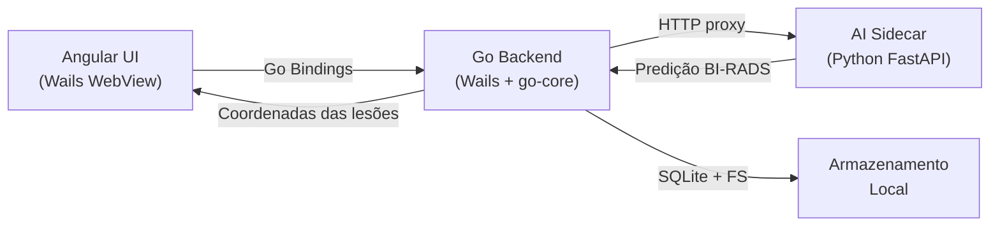

# Mamografia BI-RADS — AIdentify Desktop


Aplicação desktop para apoio à análise de mamografias com foco em execução local/offline, arquitetura modular e integração de inferência por IA.

---

## Visão Geral

**AIdentify** é uma estação de trabalho para radiologistas que combina:

- Interface clínica em **Dark Mode** de alto contraste, otimizada para salas de laudo
- Visualizador de imagens com ferramentas de anotação (marcadores, régua, zoom/pan, contraste)
- Pipeline de inferência por IA para classificação **BI-RADS** de mamografias
- Execução 100% local — sem dependência de cloud durante o uso

---

## Stack Tecnológica

| Camada | Tecnologia | Papel |
|---|---|---|
| Desktop Shell | [Wails v2](https://wails.io) + Go 1.22+ | Janela nativa, bindings Go↔Angular, WebView do OS |
| Frontend | Angular 18 (Standalone Components) | Interface, visualizador, painéis, anotações |
| Estilização | Tailwind CSS 3 | Design system "Clinical Obsidian" (Dark Mode clínico) |
| Ícones | `lucide-angular` | SVG inline para iconografia médica |
| Visualizador | Canvas 2D API + (Cornerstone.js roadmap) | Renderização DICOM/imagem com zoom, pan, filtros |
| AI Engine | Python + FastAPI + TensorFlow/Keras | Inferência com modelo U-Net treinado |
| Orquestrador | Go + Gin (`go-core`) | Guardian do sidecar, proxy, fila de tarefas |

> **Por que Wails e não Electron?**  
> Wails usa a WebView nativa do OS (WebKit/WebView2) sem embutir Chromium. Binário final de ~8 MB e ~40× menos RAM — essencial para liberar memória para o processamento de imagens médicas.

---

## Arquitetura



### Responsabilidades por camada

- **Angular UI**: Visualizador interativo, painéis de ferramentas, exibição de achados
- **Go (Wails)**: Bindings nativos, leitura de arquivos DICOM, proxy para AI sidecar
- **AI Sidecar**: Carrega `unet_mammo_best.keras`, expõe `/predict` e `/health`

---

## Funcionalidades da Interface

### Viewer de Imagens
- ✅ Carregamento de qualquer imagem (`image/*`, `.dcm`)
- ✅ Zoom via scroll do mouse ou botões
- ✅ Pan (arrastar) com ferramenta Hand
- ✅ Fit-to-screen automático
- ✅ Contraste e brilho ajustáveis em tempo real

### Ferramentas de Anotação
- ✅ **Marker** — coloca marcadores de achados (Mass/Finding) na imagem
- ✅ **Ruler** — mede distâncias em pixels
- ✅ Painel de findings com lista dinâmica e remoção individual

### Navegação por Painéis (Sidebar)
| Painel | Descrição |
|---|---|
| **Images** | Exames ativos e fila de slots para carregamento |
| **History** | Histórico de arquivos abertos na sessão |
| **Analysis** | Métricas: dimensões, zoom, contraste, nº de achados |
| **Tools** | Paleta completa: navegação, anotação, sliders de ajuste |

---

## Estrutura do Monorepo

```
desktop/
  apps/
    ui/                  # Wails (Go) + Angular — Interface Desktop
      frontend/          # Angular 18 (src/, tailwind.config.js, angular.json)
      main.go            # Ponto de entrada Wails
      app.go             # Bindings Go → Angular
      wails.json         # Config do Wails CLI
    go-core/             # Orquestrador, guardian, proxy HTTP
    ai-engine/           # FastAPI sidecar de inferência
      models/            # Modelo: unet_mammo_best.keras
  build/                 # Config de instalador
  docs/                  # Notas de arquitetura
```

---

## Política do Modelo no GitHub

Este repositório **não** armazena pipelines de treinamento.

Regra atual:
- Apenas o artefato final de inferência em: `desktop/apps/ai-engine/models/unet_mammo_best.keras`
- Arquivos de treino, datasets e jobs de cluster **não** são versionados

---

## Pré-requisitos

### Desenvolvimento local

| Dependência | Versão mínima |
|---|---|
| Go | 1.22+ |
| Wails CLI | v2.12+ |
| Node.js | 20+ |
| npm | 10+ |
| Python | 3.11+ |

```bash
# Instalar Wails CLI
go install github.com/wailsapp/wails/v2/cmd/wails@latest
```

---

## Quick Start

### 1. AI Sidecar (Python)

```bash
cd desktop/apps/ai-engine
python3 -m venv .venv && source .venv/bin/activate
pip install -r requirements.txt
```

Coloque o modelo em:
```
desktop/apps/ai-engine/models/unet_mammo_best.keras
```

### 2. Go Core (Orquestrador)

```bash
cd desktop/apps/go-core
go mod tidy
go build -o bin/go-core ./cmd/orchestrator
```

### 3. Interface Desktop (Wails + Angular)

```bash
cd desktop/apps/ui
wails dev
```

O Wails compila o Angular automaticamente e abre a janela nativa.  
Hot-reload ativo para alterações no frontend.

---

## Endpoints do Go Core (default `:8088`)

| Endpoint | Método | Descrição |
|---|---|---|
| `/healthz` | GET | Health do Go Core |
| `/readyz` | GET | Prontidão geral |
| `/startup/status` | GET | Estado de bootstrap |
| `/api/tasks/predict` | POST | Fila de predição |
| `/api/ai/*` | ANY | Proxy para AI sidecar |

## Endpoints do AI Sidecar (default `:8090`)

| Endpoint | Método | Descrição |
|---|---|---|
| `/health` | GET | Health + status do modelo |
| `/predict` | POST | Predição com upload de imagem |

---

## Segurança e Privacidade

- Comunicação exclusivamente via `127.0.0.1` (loopback)
- Token compartilhado entre Go Core e sidecar (`X-Local-Token`)
- Armazenamento local (SQLite + filesystem)
- **Offline-first**: nenhum dado médico trafega para fora da máquina

---

## Roadmap Técnico

- [ ] Binding Wails `OpenDICOMFile()` para seletor nativo de arquivo
- [ ] Integração completa Cornerstone.js para arquivos DICOM reais
- [ ] Conexão AI Engine → marcadores automáticos no visualizador
- [ ] Exportação de relatório em PDF
- [ ] Endurecimento de segurança (Unix socket local)
- [ ] Build de instalador para macOS (`.dmg`) e Windows (`.exe`)

---

## Chat Skills

O projeto é dividido em conversas especializadas:

1. **Cluster Trainer** — treino no cluster UFPI, SLURM, monitoramento
2. **Desktop Builder** — evolução da UI + Go + AI Engine
3. **Daily Reporter** — relatórios diários em linguagem acessível

Arquivos de apoio:
- `docs/chat-skills/desktop-builder.md`
- `relatorios/STATUS_ATUAL.md`

---

*Projeto em evolução para ambiente desktop médico com foco em robustez operacional e inferência local.*
