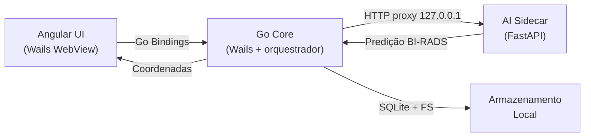

# Arquitetura — AIdentify Desktop

## Stack oficial

| Camada | Tecnologia | Papel |
|---|---|---|
| Shell nativo | Wails v2 + Go 1.22+ | Janela nativa, bindings Go↔Angular, WebView do OS |
| Frontend | Angular 18 (Standalone) | Interface, viewer, painéis, anotações |
| Estilização | Tailwind CSS 3 | Design system "Clinical Obsidian" (ver [DESIGN_SYSTEM.md](DESIGN_SYSTEM.md)) |
| Ícones | `lucide-angular` | SVG inline |
| Visualizador | Canvas 2D API (Cornerstone.js roadmap) | Render DICOM/imagem com zoom, pan, filtros |
| Core local | Go + Gin | Orquestrador, guardian, proxy, fila |
| AI sidecar | Python + FastAPI + TensorFlow/Keras | Inferência U-Net |
| Persistência | SQLite + filesystem local | Exames, anotações, metadados |

**Por que Wails e não Electron?**
Wails usa a WebView nativa (WebKit/WebView2) sem embutir Chromium. Binário ~8 MB, RAM ~40× menor — memória livre para processar imagens médicas de alta resolução.

## Topologia



### Responsabilidades

- **Angular UI**: viewer interativo, ferramentas, painéis de findings.
- **Go Core**: bindings nativos, leitura DICOM, proxy para sidecar, guardian (restarta sidecar em falha), fila de inferência, PDI local (windowing).
- **AI Sidecar**: carrega `unet_mammo_best.keras`, expõe `/health` e `/predict`.

## Monorepo

```text
mamografia-bi-rads-ia/
├── README.md                          # Cartão de visitas do projeto
├── Mammo-Desktop-Dev.command          # Launcher one-click macOS
├── apps/
│   ├── desktop/                       # Wails shell (Go)
│   │   ├── main.go                    # Entry Wails (embeds dist/)
│   │   ├── app.go                     # Bindings Go → Angular
│   │   ├── wails.json                 # Build config (frontend em ../frontend)
│   │   ├── dist/                      # Populado pelo build do frontend (gitignored)
│   │   └── build/                     # Artefatos `wails build` (darwin/windows)
│   ├── frontend/                      # Angular 18
│   │   ├── src/app/
│   │   │   ├── core/                  # Serviços globais
│   │   │   ├── features/              # viewer, annotations, study
│   │   │   └── shared/
│   │   ├── angular.json
│   │   └── package.json
│   ├── core/                          # Go Core: Orquestrador/Guardian/Proxy
│   │   ├── cmd/orchestrator/main.go
│   │   ├── internal/
│   │   │   ├── domain/{entity,valueobject}
│   │   │   └── {config,guardian,pdi,queue}
│   │   └── go.mod                     # module mammo/apps/core
│   └── ai-engine/                     # Sidecar FastAPI
│       ├── app/main.py                # /health, /predict
│       ├── models/                    # unet_mammo_best.keras
│       └── requirements.txt
├── data/                              # Runtime local (gitignored)
│   ├── studies/{study_id}/images, annotations.json, metadata.json
│   ├── db/app.db
│   └── cache/
├── build/                             # Artefatos de build compartilhados (gitignored)
│   └── docker/dev.Dockerfile          # Imagem de dev com CUDA
├── tools/
│   ├── run_desktop_dev.sh             # Entrypoint único de dev
│   └── create_macos_app.sh
├── docs/                              # Documentação consolidada (este diretório)
├── projetos/treinamento/              # Referência histórica de treinos
└── relatorios/                        # Relatórios e status atual
```

## Endpoints

**Go Core** (default `:8088`)

| Endpoint | Método | Descrição |
|---|---|---|
| `/healthz` | GET | Health do Go Core |
| `/readyz` | GET | Prontidão geral (depende do sidecar) |
| `/startup/status` | GET | Estado de bootstrap (usado pela splash) |
| `/api/tasks/predict` | POST | Enfileira tarefa de predição |
| `/api/pdi/windowing` | POST | Windowing local |
| `/api/ai/*` | ANY | Proxy para AI sidecar |

**AI Sidecar** (default `:8090`)

| Endpoint | Método | Descrição |
|---|---|---|
| `/health` | GET | Health + status do modelo |
| `/predict` | POST | Predição com upload de imagem |

## Segurança e LGPD

- Comunicação exclusivamente em `127.0.0.1` (loopback).
- Token compartilhado `X-Local-Token` entre Go Core e sidecar.
- Armazenamento local (SQLite + FS), nenhum dado clínico sai da máquina.
- Offline-first por design.

## Estratégia de escalabilidade

- Goroutines Go para pipeline de prefetch/windowing.
- Sidecar trocável por ONNX Runtime/TensorRT sem tocar na UI.
- Seam HTTP (`/api/ai/*`) permite migrar para Unix socket ou gRPC no futuro.

## Política do modelo no repositório

Apenas o artefato final de inferência é versionado: `apps/ai-engine/models/unet_mammo_best.keras`.
Pipelines de treino, datasets e checkpoints não são versionados (removidos em `0c7f4aad`).
Material de referência histórica fica em `projetos/treinamento/`.
