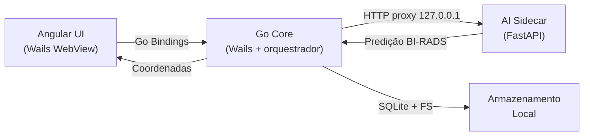

# Arquitetura — AIdentify Desktop

## Stack oficial

| Camada | Tecnologia | Papel |
|---|---|---|
| Shell nativo | Wails v2 + Go 1.25 | Janela nativa, bindings Go↔Angular, WebView do OS |
| Frontend | Angular 21 (Standalone, signals) | Interface, viewer, painéis, anotações |
| Estilização | Tailwind CSS 3 | Design system "Clinical Obsidian" (ver [DESIGN_SYSTEM.md](DESIGN_SYSTEM.md)) |
| Ícones | `lucide-angular` | SVG inline |
| Visualizador | Canvas 2D API (Cornerstone.js roadmap) | Render DICOM/imagem com zoom, pan, filtros |
| Core local | Go + Gin | Orquestrador, guardian, proxy, fila |
| AI sidecar | Python + FastAPI + ONNX Runtime | Cascata: classificador de malignidade → detector YOLO |
| Persistência | SQLite + filesystem local | Exames, anotações, metadados |

**Por que Wails e não Electron?**
Wails usa a WebView nativa (WebKit/WebView2) sem embutir Chromium. Binário ~8 MB, RAM ~40× menor — memória livre para processar imagens médicas de alta resolução.

## Topologia



### Responsabilidades

- **Angular UI**: viewer interativo, ferramentas, painéis de findings.
- **Go Core**: bindings nativos, leitura DICOM, proxy para sidecar, guardian (restarta sidecar em falha), fila de inferência, PDI local (windowing).
- **AI Sidecar**: carrega os artefatos ONNX da cascata, expõe `/health`, `/predict` e `/predict-upload`.

## Monorepo

```text
mamografia-bi-rads-ia/
├── README.md                          # Cartão de visitas do projeto
├── Mammo-Desktop-Dev.command          # Launcher one-click macOS
├── apps/
│   ├── desktop/                       # Wails shell (Go)
│   │   ├── main.go                    # Entry Wails (embeds dist/)
│   │   ├── app.go                     # Bindings Go → Angular
│   │   ├── wails.json                 # Build config (frontend em ../frontend)
│   │   ├── dist/                      # Populado pelo build do frontend (gitignored)
│   │   └── build/                     # Artefatos `wails build` (darwin/windows)
│   ├── frontend/                      # Angular 21
│   │   ├── src/app/
│   │   │   ├── core/                  # Serviços globais
│   │   │   ├── features/              # viewer, annotations, study
│   │   │   └── shared/
│   │   ├── angular.json
│   │   └── package.json
│   ├── core/                          # Go Core: Orquestrador/Guardian/Proxy
│   │   ├── cmd/server/main.go             # Composition root (~88 linhas)
│   │   ├── internal/
│   │   │   ├── domain/{entity,valueobject}
│   │   │   └── {config,guardian,pdi,queue}
│   │   └── go.mod                     # module mammo/apps/core
│   └── ai-engine/                     # Sidecar FastAPI + ONNX Runtime
│       ├── app/main.py                # Composition root (expõe `app`)
│       ├── app/routers/               # health.py, predict.py
│       ├── app/inference/             # registry.py, cascade.py (ONNX), mock.py
│       ├── models/                    # classifier_hybrid.onnx + detector_yolo.onnx
│       ├── tools/                     # conversão .pb/.pt → .onnx (offline)
│       └── requirements.txt
├── data/                              # Runtime local (gitignored)
│   ├── studies/{study_id}/images, annotations.json, metadata.json
│   ├── db/app.db
│   └── cache/
├── build/                             # Artefatos de build compartilhados (gitignored)
│   └── docker/dev.Dockerfile          # Imagem de dev com CUDA
├── tools/
│   ├── run_desktop_dev.sh             # Entrypoint único de dev
│   └── create_macos_app.sh
├── docs/                              # Documentação consolidada (este diretório)
├── projetos/treinamento/              # Referência histórica de treinos
└── relatorios/                        # Relatórios e status atual
```

## Endpoints

**Go Core** (default `:8088`)

| Endpoint | Método | Descrição |
|---|---|---|
| `/healthz` | GET | Health do Go Core |
| `/readyz` | GET | Prontidão geral (depende do sidecar) |
| `/startup/status` | GET | Estado de bootstrap (usado pela splash) |
| `/api/tasks/predict` | POST | Enfileira tarefa de predição |
| `/api/pdi/windowing` | POST | Windowing local |
| `/api/ai/*` | ANY | Proxy para AI sidecar |

**AI Sidecar** (default `:8090`)

| Endpoint | Método | Descrição |
|---|---|---|
| `/health` | GET | Health + status do modelo (sem token) |
| `/predict` | POST | Predição a partir de `{image_path}` lido do disco |
| `/predict-upload` | POST | Predição a partir de upload multipart (UI/testes) |

Exceto `/health`, todos exigem o cabeçalho `X-Local-Token` → `401` sem ele.
`/predict` responde `422` quando não consegue decodificar a imagem e há modelo
real carregado — nunca infere sobre frame vazio.

## Segurança e LGPD

- Comunicação exclusivamente em `127.0.0.1` (loopback).
- Token compartilhado `X-Local-Token` entre Go Core e sidecar.
- Armazenamento local (SQLite + FS), nenhum dado clínico sai da máquina.
- Offline-first por design.

## Estratégia de escalabilidade

- Goroutines Go para pipeline de prefetch/windowing.
- Backend de inferência trocável via `MODEL_BACKEND` (`cascade` | `mock`) sem tocar na UI.
- Seam HTTP (`/api/ai/*`) permite migrar para Unix socket ou gRPC no futuro.

## Modelo de inferência

A inferência é uma **cascata em dois estágios**, servida por ONNX Runtime (sem
TensorFlow nem PyTorch em runtime):

1. **Classificador de malignidade** (`classifier_hybrid.onnx`) — estima `P(maligno)`
   para a imagem. Arquitetura e pesos de Shen et al. (2019), treinados no INbreast.
2. **Gate** — com `P ≥ GATE_THRESHOLD` (padrão `0.11`), aciona o detector.
3. **Detector** (`detector_yolo.onnx`) — YOLOv11n treinado no TOMPEI-CMMD (vistas
   MLO; classes massa e calcificação), devolve caixas em pixels da imagem-fonte.

Quando o gate fecha, a resposta traz um único achado `kind: "assessment"` sem
caixa — avaliação nível-imagem.

**Modelos e treinamento são autoria de Micaías Carvalho Vieira**
([`micaiasdev/mammo-ai-sidecar`](https://github.com/micaiasdev/mammo-ai-sidecar)),
no âmbito do seu plano de iniciação científica.

> ⚠️ **Apoio, não diagnóstico.** São modelos de pesquisa, não validados
> clinicamente. O `birads` devolvido é **heurístico** (faixa derivada de `P`), não
> um classificador BI-RADS validado. O gate tem sensibilidade ≈ 0,69 no CMMD:
> **ausência de caixa não significa ausência de lesão**. O detector é fraco fora
> do domínio CMMD.

### Política do modelo no repositório

Nenhum peso é versionado — os `.onnx` somam ~124 MB e são instalados localmente.
A rastreabilidade fica em `apps/ai-engine/models/CHECKSUMS.txt` (versionado).
Pipelines de treino, datasets e checkpoints também não são versionados
(removidos em `0c7f4aad`); referência histórica em `projetos/treinamento/`.
